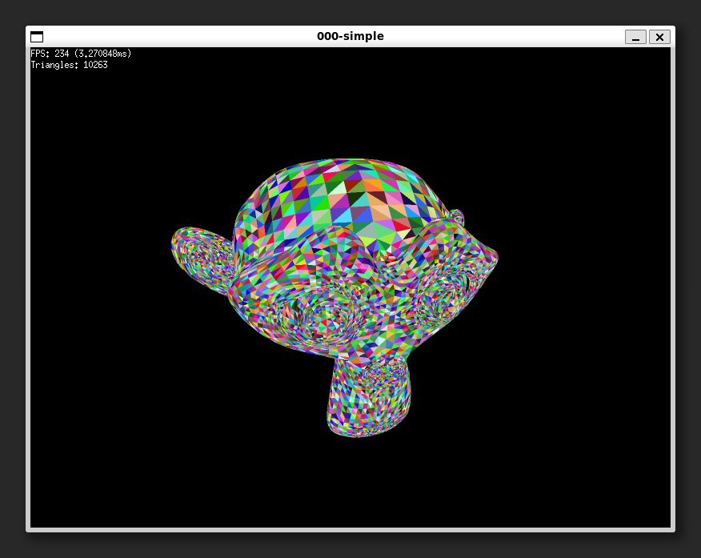

# 000 - Simple

Rendering a model with colored triangles. Simple as that.

A basic vertex pipeline that performs the following operations on Suzanne:

1. Transforms `suzanne.vertices` from Local Space -> Clip Space into a `clip_vertices` buffer.
2. Iterates `suzanne.triangles`, discarding any with a vertex that is out of bounds.
  a. For simplicity I won't be clipping triangles for now.
3. Transforms the triangle from Clip Space -> Normalized Device Coordinates (NDC)
4. Performs back-face culling on the triangle, discards back faces.
5. If front facing: Transforms NDC to Screen Space and appends the screen space data to `screen_triangles` and `screen_vertices` respectively.
  a. `screen_triangles` is used for a simple depth sort and pointing to the first vertex of this triangle.
6. Sort the `screen_triangles` slice based on the triangle's `average_z` in screen space.
7. Iterate each `screen_triangle` and populate `indices` and `vertices` with data from `screen_vertices` to be used with `screen.DrawTriangles`.
8. Done!

